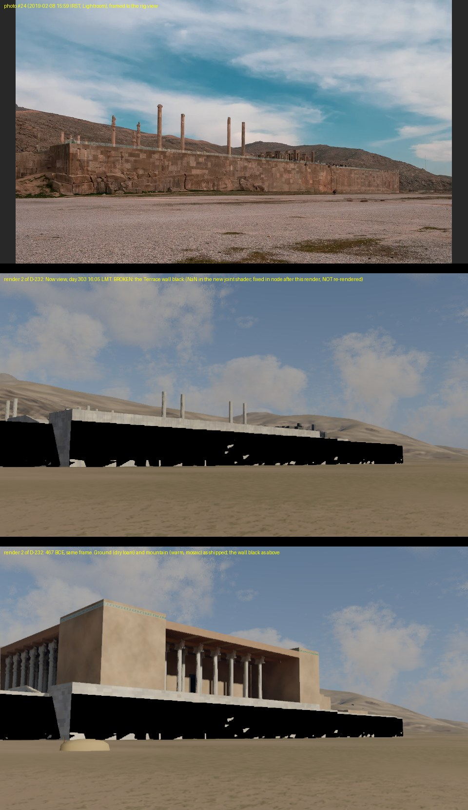

# §8.1 calibration scene: photograph #24 against the render (session 8, D-230)

**Read first: what this does and does not settle.**
- **Geometry: passed as a check.** The camera solves against the model's own Terrace outline and DEM: 6 corner correspondences
  rms 8.9 px (max 19.7 px) on the 1500 × 905 photo, and the traced Kuh-e Rahmat skyline within a median 8.0 px (0.3°) over
  150 columns. The Terrace outline (OSM/Pleiades) and the terrain (Copernicus DEM) line up with a photograph taken on the
  ground.
- **Photometry: NOT matched, and this photo cannot settle it.** The frame is a Lightroom-processed JPEG with a strong
  orange-and-teal grade (warm stone, teal sky), lifted shadows and an unknown tone curve; the sky holds thin cloud where the
  render has cumulus; the ground in the photo is the modern gravel lot, which no view models. The ratios below are recorded as
  measured. The one reversal a monotonic tone curve cannot produce (the sunlit wall 3× darker than the sky near the horizon in
  the photo, brighter than it in the render) is explained by the photo's bright thin cloud and the dark weathered wall, not
  shown to be a lighting fault. BLOCKERS B55.
- **Fixed from it:** the Now view's standing columns of the Apadana W portico (the photo shows the inner row, x −42.31; the
  recollection had two of the outer row; now_view.json, tier B for those four). **Not fixed:** the Now view's patina hue and
  tone (Q-594), two unidentified shafts with capital fragments (Q-592).

## The photograph and the camera
- `references/persepolis and the mountain behind the ruins 2.webp` (INDEX.md §6 #24; F. Kriechbaumer; Olympus E-M1 Mark II,
  14 mm; EXIF DateTimeOriginal 2019-02-08 15:59:34, taken as IRST = UT+3:30, February has no DST; Q-593).
- Sun (astronomy-engine, `tools/dev/calib24_sun.ts`): azimuth 238.84° true, altitude 19.32° (±30 min on the clock: 233.6–243.5°,
  24.7–13.7°). The same sun in the simulated year: day 303, 16.087 h LMT (az 238.91°, alt 19.40°; late winter, as the photo).
- Camera (`tools/dev/calib24_camera.py`): grid (−166.6, 108.9) on the gravel W of the Grand Stair, ground 1613.1 m asl, eye 1.6
  m, looking 117.01° true (grid 136°), pitch 7.47°, roll 0.48°, f 1461 px → vertical fov 34.4°, horizontal 54.3° (the frame is
  cropped from the sensor's 4:3; 14 mm uncropped would be f 1214 px). Seen: the Apadana salient's W face (sunlit, 12° off the
  sun), its N end face (shaded), the W wall to its SW corner 310 m away, Kuh-e Rahmat behind.
- Rig views: `tests/e2e/moments.spec.ts` `calib-24-now` (the Now view, D-201) and `calib-24` (467), same pose, fov 34.4° at
  960 × 540 (a wider frame than the photo's; roll not set).

## Ratios (linear Y from the sRGB decode; regions defined in the world, projected by each image's camera: `tools/dev/calib24_compare.py`)
| image | sunlit wall / shaded wall | sky near horizon / sunlit wall | ground / sunlit wall | mountain / sunlit wall | mountain / sky | stone in sun R/G, B/G | stone B/G ÷ sky B/G | mountain R/G ÷ stone R/G | sunlit wall Ystd/Y |
|---|---|---|---|---|---|---|---|---|---|
| photo #24 | 3.86 | 3.06 | 2.12 | 1.29 | 0.42 | 1.88, 0.62 | 0.50 | 0.72 | 0.366 |
| render, Now view | 8.65 | 0.73 | 0.21 | 0.76 | 1.04 | 1.14, 0.78 | 0.68 | 1.01 | 0.093 |
| render, 467 | 6.97 | 0.56 | 0.19 | 0.78 | 1.39 | 1.13, 0.80 | 0.79 | 1.07 | 0.081 |

Absolute linear Y (each image's own exposure): photo wall 0.100, shade 0.026, ground 0.213, sky 0.307; Now render 0.268,
0.031, 0.057, 0.196; 467 render 0.332, 0.048, 0.062, 0.187. Frame means (display luma): Now 102.5, 467 99.7; exposure 1.39
and 1.49, sun altitude 19.4°.

## Reading
1. **Sun : shade on the wall** (3.9 photo vs 7.0–8.7 render). A clear-sky estimate for this geometry (direct normal ~1, the
   face 0.92 of it, skylight on a vertical face ~0.1, ground bounce ~0.05; the shaded N face gets ~0.1) gives ~8–10, the
   render's range. The photo's 3.9 is what Lightroom's shadow lift and the thin cloud's added diffuse light would make of it.
   No change made; a raw file of the frame would settle it (B55).
2. **The sky and the ground** differ by the scene, not the renderer: thin bright cloud in the photo's horizon band vs the
   weather's cumulus; the modern gravel lot (pale, seen with the sun behind the camera) vs the plain's loam.
3. **The weathered W wall is warm red-brown against its own mountain** (mountain R/G ÷ stone R/G 0.72; a grade that multiplies
   channels cancels in this ratio), where the Now view's patina is a neutral grey crust (1.01). The Gate's lintel (#5, neutral
   light) shows a light grey skin instead: the patina differs by surface. Q-594.
4. **Stone spread**: the 467 render's sunlit wall at this range reads Ystd/Y 0.081, as the CPU mirror predicted for D-230's
   stone at the photo's scale (0.079, tests/stone_photo_d230.test.ts); the weathered wall in the photo 0.37 (B40).
5. **The Now view's standing columns**: four shafts above the wall match the inner row of the W portico (x −42.31 at y 16.7,
   8.06, −17.86, −26.5; tops within 0.05–0.52° of the photo, the outer row 0.63–0.93° off; `tools/dev/calib24_columns.ts`); the
   recalled (−50.95, −0.58) and the fragment at (−50.95, 8.06) have nothing on their rays. Moved in now_view.json (the count of
   13 kept). NOT re-rendered after the change.

## D-232 (session 8 workstream): the three faults of the side-by-side
**Read first: the Terrace wall is broken in both D-232 renders and its fix is NOT rendered.** `side_by_side.jpg` is now render 2
of D-232: its walls are **black** (NaN from the new joint shader, fixed in node afterwards). `side_by_side_d232_render1.jpg` is
render 1: the 467 wall one flat tone (the foot's TSL assignments dropped). The ground and the mountain in both are as shipped.
| image | sky / ground | ground / sunlit wall | mountain / sky | mountain R/G, B/G (display) | mountain Ystd/Y, 12 px windows |
|---|---|---|---|---|---|
| photo #24 | 1.45 | 2.12 (modern gravel: not the target) | 0.27 | 1.56, 0.75 (graded) | 0.29 |
| before, Now / 467 | 3.43 / 3.02 | 0.21 / 0.19 | 0.68 / 0.60 | 1.15, 0.79 / 1.15, 0.77 | 0.154 / 0.136 |
| D-232 render 1, Now / 467 | 2.06 / 1.84 | 0.36 / 0.36 | 0.70 / 0.65 | 1.25, 0.74 / 1.29, 0.71 | 0.163 / 0.118 |
| D-232 render 2, Now / 467 | 1.87 / 1.65 | – (wall black) | 0.71 / 0.70 | 1.22, 0.77 / 1.24, 0.76 | 0.172 / 0.127 |
Mountain columns from tools/dev/calib24_mountain.py (DEM hits 0.4-2.5 km, clear of the skyline and the wall; 467 in columns
690-960 right of the Apadana); the rest from tools/dev/calib24_compare.py. The wall layout itself: shots/masonry_compare_d232.png
(node preview against the rectified photo) and DECISIONS D-232.
